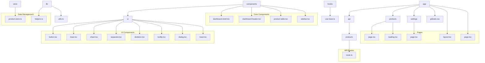
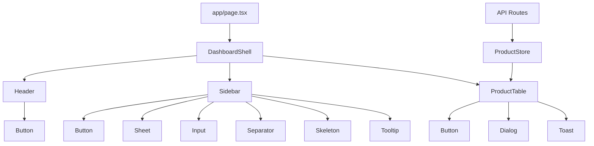

# Admin Dashboard

A Next.js-based admin dashboard application for managing products and inventory.

## Project Structure

```mermaid
graph TD
    A[app] --> B[api]
    A --> C[products]
    A --> D[settings]
    A --> E[globals.css]
    A --> F[layout.tsx]
    A --> G[page.tsx]

    B --> H[products]
    H --> I[route.ts]

    C --> J[page.tsx]
    C --> K[loading.tsx]

    D --> L[page.tsx]

    M[components] --> N[ui]
    M --> O[dashboard-shell.tsx]
    M --> P[dashboard-header.tsx]
    M --> Q[product-table.tsx]
    M --> R[sidebar.tsx]

    N --> S[button.tsx]
    N --> T[input.tsx]
    N --> U[sheet.tsx]
    N --> V[separator.tsx]
    N --> W[skeleton.tsx]
    N --> X[tooltip.tsx]
    N --> Y[dialog.tsx]
    N --> Z[toast.tsx]

    AA[lib] --> AB[helpers.ts]
    AA --> AC[utils.ts]

    AD[hooks] --> AE[use-toast.ts]

    AF[store] --> AG[product-store.ts]

    subgraph Core Components
        O
        P
        Q
        R
    end

    subgraph UI Components
        S
        T
        U
        V
        W
        X
        Y
        Z
    end

    subgraph Data Management
        AG
        AB
    end

    subgraph Pages
        F
        G
        J
        K
        L
    end

    subgraph API Routes
        I
    end
```

## Component Relationships

```mermaid
flowchart TD
    A[app/page.tsx] --> B[DashboardShell]
    B --> C[Header]
    B --> D[Sidebar]
    B --> E[ProductTable]

    D --> F[Button]
    D --> G[Sheet]
    D --> H[Input]
    D --> I[Separator]
    D --> J[Skeleton]
    D --> K[Tooltip]

    E --> L[Button]
    E --> M[Dialog]
    E --> N[Toast]

    C --> O[Button]

    P[ProductStore] --> E
    Q[API Routes] --> P
```
